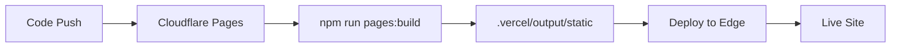

# Cloudflare Pages Deployment with @cloudflare/next-on-pages

## 🚀 Quick Deploy

### Option 1: Via Cloudflare Dashboard (Recommended)

1. **Push your code to Git** (GitHub, GitLab, or Bitbucket)

2. **Go to Cloudflare Dashboard**
   - Navigate to Pages
   - Click "Create a project"
   - Connect your Git repository

3. **Configure Build Settings**
   ```
   Framework preset: Next.js
   Build command: npm run pages:build
   Build output directory: .vercel/output/static
   Root directory: (leave empty)
   ```

4. **Add Environment Variables**
   ```
   NEXT_PUBLIC_API_URL=https://your-backend-url.com
   NODE_VERSION=18
   ```

5. **Deploy!**
   - Click "Save and Deploy"
   - Cloudflare will build and deploy automatically

### Option 2: Via Wrangler CLI

1. **Install Wrangler globally**
   ```bash
   npm install -g wrangler
   ```

2. **Login to Cloudflare**
   ```bash
   wrangler login
   ```

3. **Build for Cloudflare**
   ```bash
   npm run pages:build
   ```

4. **Deploy**
   ```bash
   npm run pages:deploy
   ```

   Or manually:
   ```bash
   wrangler pages deploy .vercel/output/static --project-name=audit-iq
   ```

## 📋 Build Commands Reference

```bash
# Development with Cloudflare Pages emulation
npm run pages:dev

# Build for Cloudflare Pages
npm run pages:build

# Deploy to Cloudflare Pages
npm run pages:deploy

# Regular Next.js development
npm run dev

# Regular Next.js build
npm run build
```

## ⚙️ Configuration Files

### `wrangler.toml`
```toml
name = "audit-iq"
compatibility_date = "2025-12-10"
pages_build_output_dir = ".vercel/output/static"
```

### `package.json` scripts
```json
{
  "scripts": {
    "pages:build": "npx @cloudflare/next-on-pages",
    "pages:deploy": "npm run pages:build && wrangler pages deploy",
    "pages:dev": "npx @cloudflare/next-on-pages --watch"
  }
}
```

## 🔧 Environment Variables

Add these in Cloudflare Pages dashboard under **Settings > Environment variables**:

### Production
```
NEXT_PUBLIC_API_URL=https://your-production-backend.com
NODE_VERSION=18
```

### Preview (optional)
```
NEXT_PUBLIC_API_URL=https://your-staging-backend.com
NODE_VERSION=18
```

## ✅ Features Supported

With `@cloudflare/next-on-pages`, you get:

- ✅ **Server-Side Rendering (SSR)**
- ✅ **API Routes** (`/api/*`)
- ✅ **Dynamic Routes**
- ✅ **Middleware**
- ✅ **Image Optimization** (via Cloudflare Images)
- ✅ **Edge Runtime**
- ✅ **Incremental Static Regeneration (ISR)** (limited)

## 🎯 Cloudflare Dashboard Settings

When creating/configuring your Pages project:

**Build configuration:**
- **Build command:** `npm run pages:build`
- **Build output directory:** `.vercel/output/static`
- **Root directory:** (leave empty)

**Build system:**
- **Framework preset:** Next.js (or None)
- **Node.js version:** 18 or higher

## 🔍 Troubleshooting

### Build fails with "Module not found"
```bash
# Clear cache and reinstall
rm -rf node_modules package-lock.json
npm install
npm run pages:build
```

### "wrangler: command not found"
```bash
# Install wrangler globally
npm install -g wrangler

# Or use npx
npx wrangler pages deploy
```

### Build output directory not found
Make sure you run `npm run pages:build` before deploying. The build creates `.vercel/output/static`.

### Environment variables not working
- Check they're added in Cloudflare Pages dashboard
- Prefix client-side vars with `NEXT_PUBLIC_`
- Redeploy after adding new variables

## 📊 Deployment Workflow



## 🌐 Custom Domain

1. Go to Cloudflare Pages project
2. Click **Custom domains**
3. Add your domain
4. Cloudflare will automatically configure DNS

## 📈 Monitoring

- **Analytics:** Cloudflare Pages dashboard
- **Logs:** Wrangler tail or Pages Functions logs
- **Performance:** Cloudflare Web Analytics

## 🔗 Useful Links

- [Next-on-Pages Docs](https://github.com/cloudflare/next-on-pages)
- [Cloudflare Pages Docs](https://developers.cloudflare.com/pages/)
- [Wrangler CLI Docs](https://developers.cloudflare.com/workers/wrangler/)

---

**Ready to deploy!** 🚀

Choose your deployment method and follow the steps above.
